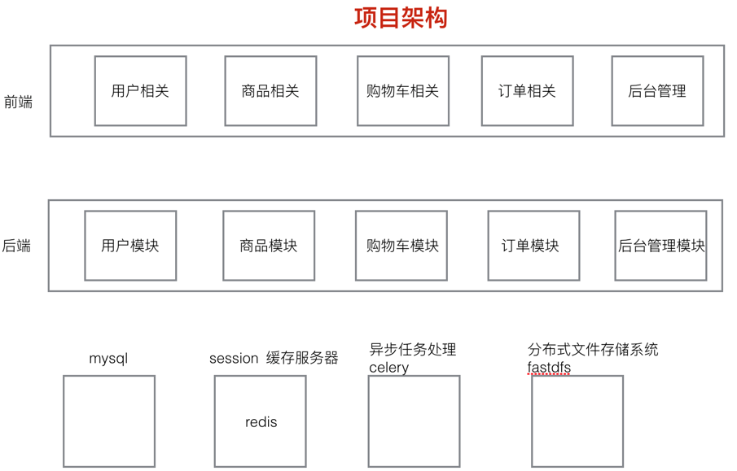
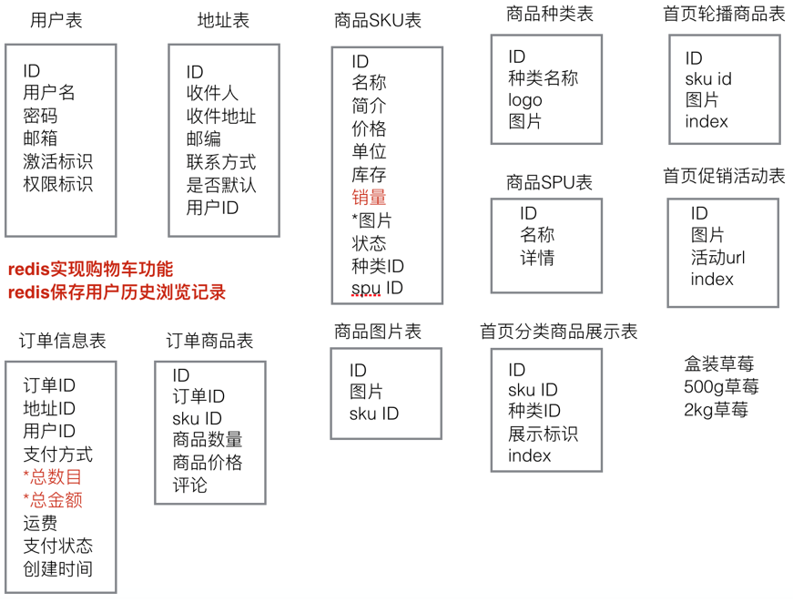
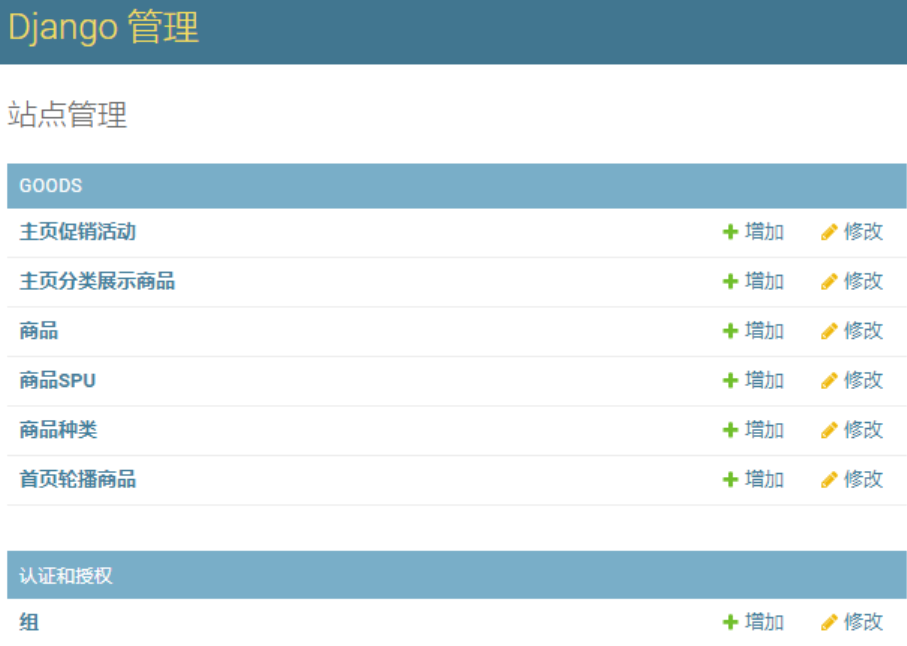

# <p align="center">天天生鲜-django3.0版本</p>


<p align="center">
    <a href="https://github.com/xuyanbo03/daily-fresh"></a>
    <a href="https://github.com/python/cpython"></a>
    <a href="https://opensource.org/licenses/mit-license.php"></a>
    <a href="https://github.com/xuyanbo03/daily-fresh"></a>
    <a href="https://github.com/xuyanbo03/daily-fresh/graphs/contributors"></a>
    <a href="https://github.com/xuyanbo03/daily-fresh/stargazers"></a>
    <a href="https://github.com/xuyanbo03/daily-fresh/network/members"></a>
    <a href="https://www.python.org/"></a>
</p>


## 项目简介

**本项目使用django3.0.5实现天天生鲜电商项目**，该项目包含了实际开发中的电商项目中大部分的功能开发和知识点实践，同时也记录开发过程中遇到的坑，记录在[个人博客](https://www.awebone.com/)中，希望对各位的学习有所帮助。

**关键词：** Django3 MySQL Redis celery FastDFS Nginx haystack whoosh  jieba 高并发 分布式

<br/>


## 如何运行

1. 依赖库安装

   ```bash
   # 克隆本项目
   git clone https://github.com/xuyanbo03/daily-fresh.git
   # 跳转到项目目录
   cd 目录名
   # 先卸载依赖库
   pip uninstall -y -r requirement.txt
   # 再重新安装依赖库
   pip install -r requirement.txt
   ```

2. 数据库准备（Linux服务器）

   ```bash
   # MySQL数据库启动
   sudo service mysql start
   # MySQL建表
   CREATE DATABASE `dailyfresh` CHARACTER SET 'utf8';
   # Redis服务器启动
   sudo service redis-server start
   ```

3. FastDFS和Nginx启动（Linux服务器）

   ```bash
   # Nginx启动
   sudo /usr/local/nginx/sbin/nginx
   # FastDFS trackerd服务启动
   sudo service fdfs_trackerd start
   # FastDFS storaged服务启动
   sudo service fdfs_storaged start
   ```

4. 项目参数修改

   ```bash
   # 修改Django项目setting文件
   vim dailyfresh.settings.py
   
   # 修改下列的自定义参数，示例如下
   MYSQL_HOST = '192.168.123.130'
   MYSQL_USER = 'root'
   MYSQL_PASSWORD = 'mysql'
   REDIS_HOST = 'redis://192.168.123.130:6379/'
   EMAIL_HOST_USER = '你自己的163邮箱@163.com'
   SMTP_EMAIL_HOST_PASSWORD = 'XXXXXXXXXXXXXXXX'  # 16位邮箱授权码
   EMAIL_FROM = '天天生鲜<你自己的163邮箱@163.com>'
   NGINX_FDFS_URL = 'http://192.168.123.130:8888/'
   ALIPAY_APPID = "2016090800464054"  # 若使用支付，修改为自己的，该APPID已过期
   ALIPAY_DEBUG = True
   ALIPAY_PAY_URL = 'https://openapi.alipaydev.com/gateway.do?'  # 若使用支付，修改为自己的，该URL已更改
   ```
   
5. 项目启动

   ```bash
   # 数据库迁移
   python manage.py makemigrations
   python manage.py migrate
   
   # celery启动
   celery -A celery_tasks.tasks worker --pool=solo -l info
   
   # 后台访问需创建超级管理员
   python manage.py createsuperuser
   
   # 运行
   python manage.py runserver
   ```

6. 项目部署

   ```bash
   # 配置uwsgi，可配置多个
   vim uwsgi_nginx.ini
   uwsgi --ini uwsgi_nginx.ini
   
   # nginx配置文件配置，按照nginx.conf配置，可实现负载均衡，并重启nginx
   vim nginx.conf
   sudo /usr/local/nginx/sbin/nginx -s reload
   ```

   

<br/>


## 开发环境

```text
Python: 3.7.2
Django: 3.0.5
pycharm: 2019.3
client OS: win 10
server OS: ubuntu 16.04
MySQL: 5.6
Redis: 3.0
```

<br/>


## 关键技术栈

- MySQL数据库：数据存储
  - 业务数据和Django内部数据存储
  - 事务处理
  - 并发控制：悲观锁和乐观锁
- Redis数据库：提升网站性能，提升用户体验
  - 作为消息队列，celery broker存储
  - Session缓存
  - 用户历史浏览缓存
  - 购物车记录缓存
- celery：异步处理
  - 邮件异步发送
  - 首页静态缓存
- FastDFS分布式文件系统：作为静态图片存储服务器
- Nginx：web服务器
  - 静态文件访问
  - web服务
  - 调度服务器，实现负载均衡
- haystack+whoosh+jieba：全文检索框架，修改底层haystack库使之对中文搜索更加友好
- 支付宝支付：支付流程
  - 沙盒环境
- uwsgi+nginx服务部署

<br/>


## 功能模块

- [x] 用户模块
    - [x] 注册
    - [x] 登录
    - [x] 邮件激活(celery+itsdangerous)
    - [x] 退出
    - [x] 个人中心
    - [x] 地址管理
- [x] 商品模块
    - [x] 首页静态化(celery+nginx)
    - [x] 商品详情
    - [x] 商品列表
    - [x] 搜索功能(haystack+whoosh+jieba)
- [x] 购物车模块(redis)
    - [x] 增加
    - [x] 删除
    - [x] 修改
    - [x] 查询
- [x] 订单模块
    - [x] 确认订单页面
    - [x] 订单创建
    - [x] 请求支付(支付宝)
    - [x] 查询支付结果
    - [x] 评论

<br/>


## 项目架构图



<br/>


## 数据库表分析图



<br/>


## 效果图




<br/>


## 补充

- 项目持续更新，欢迎您[star本项目](https://github.com/xuyanbo03/daily-fresh)

<br/>


## License

[The MIT License (MIT)](http://opensource.org/licenses/MIT)

